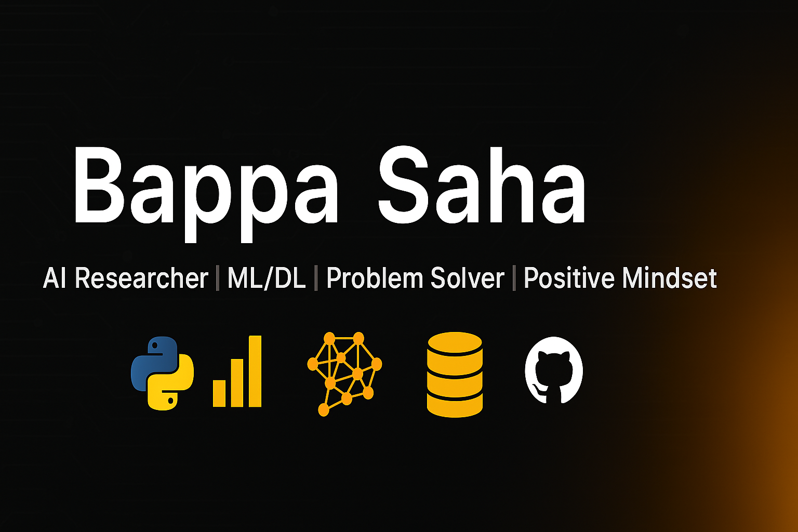

<!-- Custom Banner -->

  <!-- Put your banner file at: /assets/banner.png in this repo -->
  

<!-- Introduction -->
<h2 align="center">👋 Hi, I'm Bappa Saha</h2>

  🚀 AI Researcher (ML/DL | Federated Learning | IDS)  
  💻 Problem Solver | 📚 Lifelong Learner | 🌍 Collaborator  

---

## 🌟 About Me

I am a **Computer Science undergraduate** passionate about **Artificial Intelligence, Machine Learning, Deep Learning, and Cybersecurity**.  
I focus on **building intelligent systems** that drive real-world impact and contribute to **research for Q1-ranked journals**.

✨ *“Great systems are built not only with code, but with vision, collaboration, and persistence.”*

- 🔥 Skilled in **Python, ML/DL, DSA, SQL**
- 🧠 Research Areas: **Healthcare AI, Cybersecurity , Federated Learning**
- 🤝 Strong leadership, teamwork & problem-solving mindset
- 🎯 Goal: Bridge **academic research** and **practical applications**

---

## 🛠️ Skills & Tools

  <!-- Languages -->
  
  
  
  

  <!-- Frameworks -->
  
  
  

  <!-- Tools -->
  
  
  
  

---

## 🚀 Featured Projects

- 🧠 **AI for Healthcare** 
- 📱 **Messaging App** – 
- 🐍 **Python  Projects** – Problem solving, algorithms & automation  
  

---

## 📚 Publications

> 📝 *Some works are Coming soon.*

---

## 📊 GitHub Insights

  
Show Stats

  

    
    
  

  

    
  

  

    
  

---

## 🌍 Let’s Connect

  
  
  
  <a href="https://kaggle.com/<your-kaggle-username>">
    
  </a>
  <a href="https://scholar.google.com/citations?user=<your-id>">
    
  </a>

---

  

